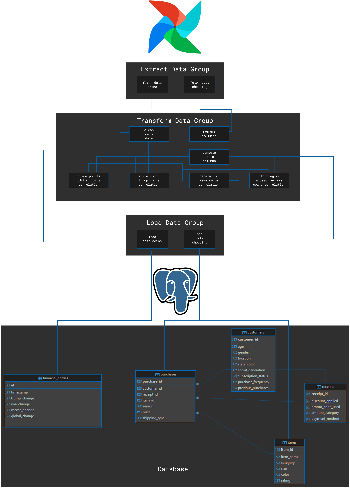
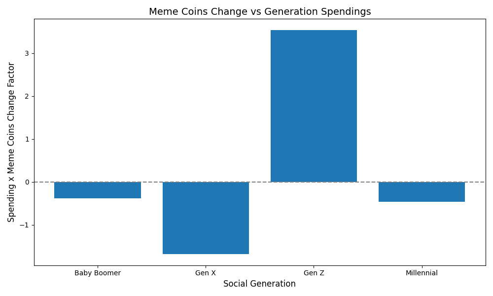
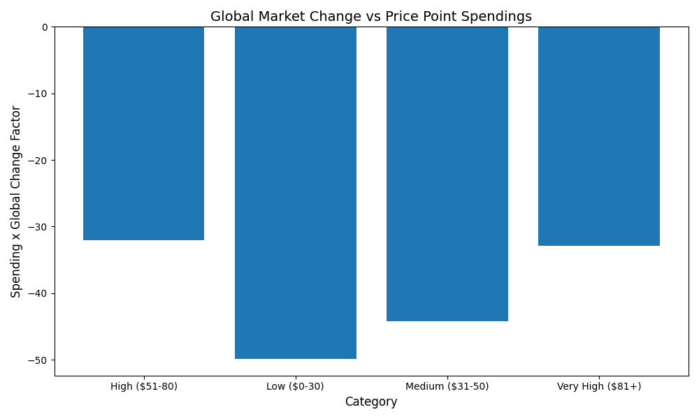
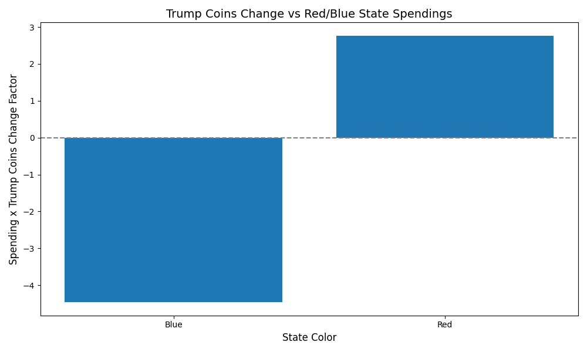
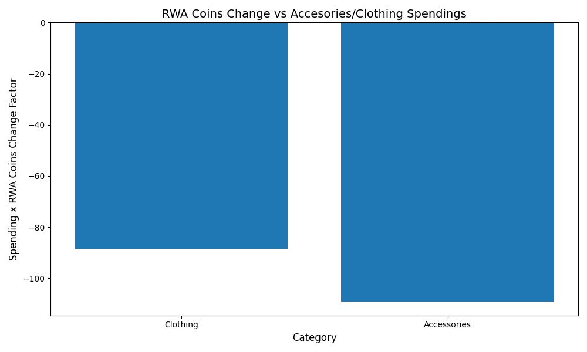

# Shopping Behavior - Crypto Market ETL Pipeline
This pipeline is built using an Apache Airflow Docker container. It contains a single DAG that:
- extracts the batch customer behavior and real-time crypto market performance
- cleans and normalizes the data, computes new columns
- analyzes the data to find correlations - which are plotted and saved for every run
- splits the data into multiple tables in a star schema that supports analytical queries
- loads the data into a Postgres database

All required files and directories are included.
## Environment Setup
build the container:
```
docker-compose build
```
start the container:
```
docker-compose up -d
```

Access the Airflow webserver at `http://localhost:8081` (not 8080).

## Database Tables Setup
```sql
create table if not exists items (
item_id serial primary key,
item_name VARCHAR(30) not null,
category VARCHAR(30) not null,
size VARCHAR(5) not null,
color VARCHAR(30) not null,
rating float
);

create table if not exists customers (
customer_id serial primary key,
age int,
gender VARCHAR(15),
location VARCHAR(30),
state_color VARCHAR(15),
social_generation VARCHAR(30),
subscription_status bool,
purchase_frequency VARCHAR(30),
previous_purchases int 
);

create table if not exists receipts (
receipt_id serial primary key,
discount_applied bool,
promo_code_used bool,
amount_category VARCHAR(30),
payment_method VARCHAR(30)
);

create table if not exists purchases (
purchase_id serial primary key,
customer_id int not null references customers (customer_id) on update cascade,
receipt_id int not null references receipts (receipt_id) on update cascade,
item_id int not null references items(item_id) on update cascade,
season VARCHAR(15),
price float,
shipping_type VARCHAR(30)
);

create table if not exists financial_entries (
id serial primary key,
timestamp int not null,
trump_change float,
rwa_change float,
meme_change float,
global_change float
);
```

## Pipeline Diagram


## Functionality Overview
Base Functionality:
- Build the ETL pipeline using Apache Airflow in a Docker container
- Extract, Transform, and Load the data into a Postgres database

Personal approach to joining customer segments to relevant crypto market trends:\
\
I decided on four different customer segment - crypto market relations to analyze and try to find correlations:
 - Generation vs. Meme Coin Performance: [Younger generations (Gen Z, Millennials) are more likely to invest in meme coins](https://www.osl.com/hk-en/academy/article/memecoin-culture-understanding-the-rise-of-meme-based-crypto) 
 - Price Point preference vs. Global Crypto Market Performance: A well performing global crypto market may lead to consumers having more disposable income, leading to a preference for higher price points.
 - State Color vs Trump Coin Performance: People in Republican states may be more likely to invest in Trump-affiliated coins, so a better performance of those coins may lead to more purchases from those states.
 - Item Category vs RWA Performance: Real World Asset (RWA) performance may influence purchasing behavior in specific item categories. I chose to compare 'Clothing' vs 'Accesories' categories to see if the coin performance can reflect the real-world.
\

The pipeline plots these correlations and saves the plots for every run (for every timestamp at which the coin data is extracted).

## Results
### Sample correlation plots generated by the pipeline:
Note: The costumer data is purely fictional and very balanced so the correlations are not expected to be significant.





## Performance
For the default dataset (3900 entries) + 4 real-time data points, the pipeline runs in 10-20 seconds:
- Extract task: 3.02s
- Transform group: 9.90s
- Load data task: 3.99s

Using a larger dataset (10000) generated using a Python script with random choices, the pipeline runs in 20-30 seconds:
- Extract task: 4.43s
- Transform group: 13s
- Load data task: 8.19s

20000 entries: 20-30 seconds:
- Extract task: 2.85s
- Transform group: 17s
- Load data task: 6.95s - the load time is shorter because previous data is already in the DB and is ignored

## Limitations
- For datasets above 50000 entries, the pipeline might fail as the Airflow container runs out of memory.
- API rate limits the ETL to not be run multiples times in a short time (1 minute)

## Possible Improvements
- Use chunks within the ETL to handle larger datasets
- Loading of larger datasets may not always produce correct results as ids may change
- Add more logs and error handling
- Add data validation, anomaly detection steps, test for spikes
- Add unit tests for the functions
- Looking into different Airflow executors to improve performance